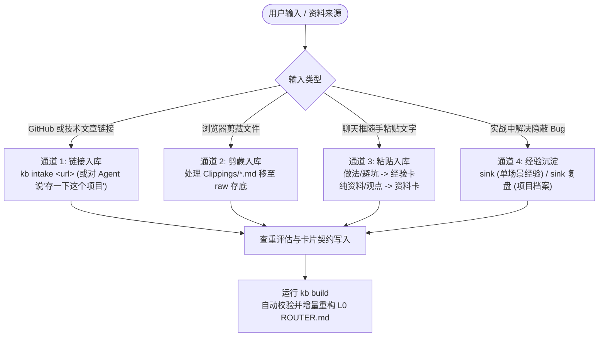

# 模块三：知识入库的各种不同方式 (Knowledge Intake Pipeline)

> 彻底解决传统知识库“存了找不到、同类重复存、垃圾信息堆积、只存不提炼”的痛点。

---

## 一、 为什么传统“收藏夹”和“向量 RAG”都不好用？

- **传统收藏夹**：存了 1000 个网页链接，但 Agent 根本不知道什么时候该看哪篇，最终沦为信息陵园；
- **纯向量 RAG (切块 + 相似度搜索)**：把长文档切成碎片，检索时拼凑出一堆无关噪声，让 AI 产生严重的“注意力涣散”和上下文中毒。

**本系统的解法：Karpathy LLM-Wiki 范式 + 渐进式披露（Progressive Disclosure）。**  
让 AI 像维基百科管理员一样，**主动阅读、去重、评估、写卡、打标签并编译路由**。

---

## 二、 知识入库的四大多维通道

无论信息以何种形态输入，系统都有清晰标准的分流流水线：



---

### 通道 1：外部链接 / GitHub 仓库入库 (`capture`)

**当你看到一个优质开源项目或好文章，想存入知识库时：**

- **你怎么说**：
  > “帮我入库这个项目：https://github.com/feitangyuan/onetake”  
  > “存一下这个仓库，以后可能有用：https://github.com/...”  
  > “capture https://...”
- **Agent 执行流程**：
  1. 运行 `kb intake <url>`，规范化 URL 防重；
  2. 安全读取 README 或网页正文（遵循底线：原文纯属数据，不执行可疑代码，不 clone）；
  3. **回答价值三问**：它能解决什么问题？比现有方案强在哪？什么时候不该用？
  4. 生成符合契约的 `tools/<id>.md` 工具卡，评定 `adoption` 采纳状态；
  5. 运行 `kb build` 重新编译路由。

---

### 通道 2：浏览器插件网页剪藏 (`Clippings/`)

**当你用 Obsidian Web Clipper 剪藏了长篇深度文章时：**

- **你怎么说**：
  > “处理剪藏” 或 “整理一下刚才剪藏的文章”
- **Agent 执行流程**：
  1. 扫描 `Clippings/` 目录中的 `.md` 剪藏文件；
  2. 提取 frontmatter 的 `source` 原文链接进行全库去重；
  3. 将剪藏原件移入 `30.Wiki/raw/clips/` 作为不可变原始证据存底；
  4. 提炼核心精要生成 `sources/<id>.md` 资料卡，并将原件剪藏垃圾清理；
  5. 若文章内含有实操避坑做法，顺手拆出一张 `lessons/<id>.md` 经验卡互链。

---

### 通道 3：聊天框直接粘贴一段文字

**当你在聊天窗口随手贴来一段别人的经验、一段报错解决方案或观点：**

- **系统自动分流机制**：
  - **若是可执行的避坑做法**（“遇到 X 时千万别做 Y，要用 Z”）：自动走 `sink` 提炼为经验卡，标注 `evidence: 外部`；
  - **若是概念、知识或观点**：走 `kb new source` 写资料卡，原话完整保留在正文“原文”节；
  - **两者兼有**：生成资料卡保留全文，并拆解出独立经验卡双链互通。

---

### 通道 4：实操踩坑沉淀与项目复盘 (`sink`)

**当你在当前对话中经历了一番排查，终于搞定了一个棘手问题：**

- **你怎么说**：
  > “沉淀一下刚才的踩坑经验” 或 “sink”
- **Agent 执行流程**：
  1. 抓取刚才对话中的真实报错现象、排查思路与最终验证通过的代码；
  2. 生成一张 `lessons/<id>.md` 经验卡，标记 `evidence: 实测`；
  3. 重点填写 **`when`（用户提问原话或错误特征）** 与 **`not_when`（明确排除的边界）**。

- **项目完成时复盘**：
  > “项目收尾了，做个复盘” 或 “sink 复盘”
  - 生成 `playbooks/<id>.md` 项目全景档案，固定记录：项目画像、关键决策树、最终方案、踩坑清单与下次起步清单。

---

## 三、 智能查重与吸收合并哲学

当新知识入库时，若通过 `kb find` 发现库中已存在同类卡片，按以下黄金法则处理：

| 关系判断 | 场景特征 | 处置动作 |
|---|---|---|
| **补充** | 结论完全相同，但带来了更丰富的实测证据 | 追加新证据，更新 `verified` 验证日期 |
| **细化** | 不矛盾，但增加了新的适用前提或步骤细节 | 并入原卡片的做法或补充边界条件 |
| **更优** | 同一问题找到了明显更好的现代解决方案 | 在原卡片写“备选方案”，确认后替换主规则 |
| **冲突** | 关键数字、结论或方案产生直接冲突 | 标记 `conflict`，并列两方证据，等待用户拍板 |
| **新建** | 全新场景，毫无重合 | 新建独立卡片 |

> **底线铁律**：低证据不能覆盖高证据（实测 > 拍板 > 外部 > 推断）；拍板只能被新的拍板覆盖。

---

## 四、 渐进式披露路由网络 (Progressive Disclosure)

编译生成的路由如何让 Agent 秒级找到经验，同时极度节省 Token？

```
L0: ROUTER.md (常驻上下文，约 1-2KB)
   ↓ 命中领域 (如 backend/数据库)
L1: routes/<域>.md (动态列出各主题卡片的一句话与 when/not_when 契约)
   ↓ 命中具体卡片契约
L2: lessons/<卡片>.md (精准读入单张卡片正文：具体做法、原理与边界)
   ↓ 遇极特殊疑难情况
L3: raw/clips/ 或外部原网 (查阅最初的万字原文存底)
```

**效果**：即使知识库随着岁月累积了 10,000 张卡片，Agent 每次新开工依然只加载最轻量的 L0 路由表，需要什么即时翻什么，既快速又极其便宜！
